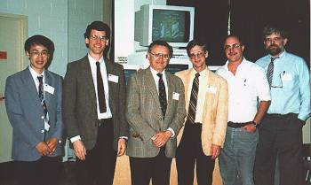

# Geophysical electromagnetics- A retrospective, DISC 2017, and a look forward  

_Douglas W. Oldenburg, Lindsey J. Heagy and Seogi Kang_

(https://doi.org/10.1190/tle40020140.1)



## Summary

Geophysical electromagnetics (EM) plays an important role in mineral exploration and is increasingly being used to help solve other problems of relevance to society. In this article we reflect, from our perspective at the University of British Columbia, on the development of EM geophysics over the years, on our attempts to enhance understanding of EM geophysics, and on its visibility and usefulness to the community. The availability of open-source resources and a shift within the EM community toward collabora-tive practices for sharing and creating software and educational resources have been drivers of progress toward these goals. In this article, we provide background about this trajectory and discuss how the SEG Distinguished Instructor Short Course was a catalyst in our development of software and resources as well as in our broader goal of creating more collaborative connections within the EM community.

## Citation

Douglas W. Oldenburg, Lindsey J. Heagy, Seogi Kang; Geophysical electromagnetics: A retrospective, DISC 2017, and a look forward. The Leading Edge 2021;; 40 (2): 140–148. doi: https://doi.org/10.1190/tle40020140.1

```
@article{oldenburg_electromagnetics_2021,
    author = {Oldenburg, Douglas W. and Heagy, Lindsey J. and Kang, Seogi},
    title = "{Geophysical electromagnetics: A retrospective, DISC 2017, and a look forward}",
    journal = {The Leading Edge},
    volume = {40},
    number = {2},
    pages = {140-148},
    year = {2021},
    month = {02},
    issn = {1070-485X},
    doi = {10.1190/tle40020140.1},
    url = {https://doi.org/10.1190/tle40020140.1}
}

```
